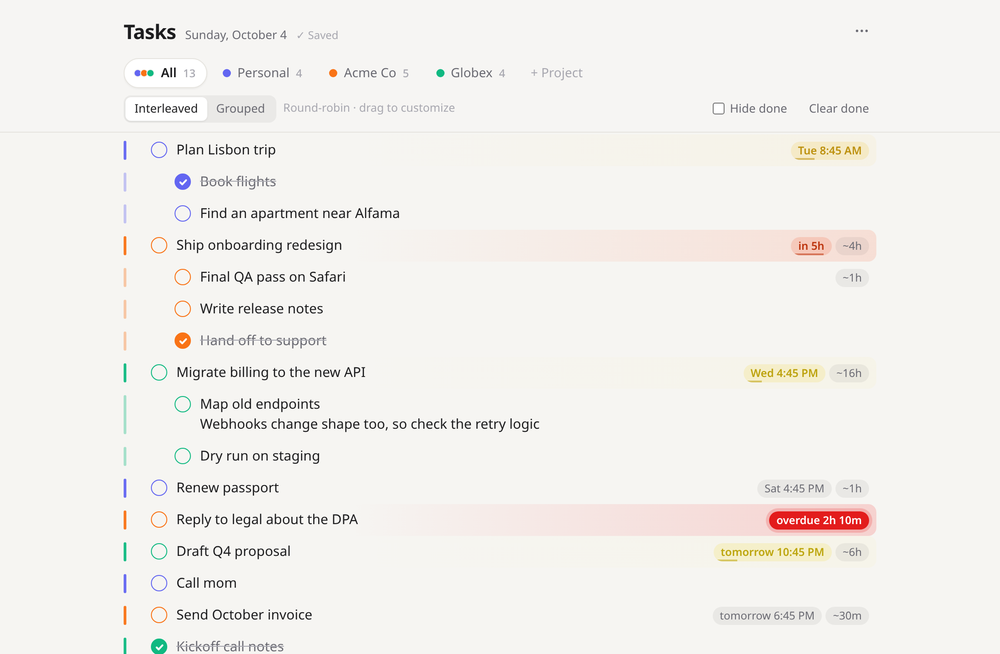

# Task List

**[Website & live demo](https://meelash.github.io/task-list/)** · [Download for Fedora](https://github.com/meelash/task-list/releases/latest) · [Request another platform or cloud sync](https://github.com/meelash/task-list/issues/new/choose)



A keyboard-first task list with projects/clients, deadlines, and drag-to-prioritize, stored in SQLite.
There are no dependencies: it needs Node 22.13+ (it uses the built-in `node:sqlite`).

## Install as a desktop app (Fedora)

```sh
./packaging/build-rpm.sh
sudo dnf install ./dist/task-list-*.rpm      # use the exact file name the script prints
```

This installs **Task List** in Activities with its own window (GTK + WebKitGTK, not a browser):
- The server runs as the systemd user service `task-list.service`, enabled for every user at login.
  The app also starts it if it isn't running.
- The window opens automatically at login (`/etc/xdg/autostart`). To turn that off, use GNOME Tweaks → Startup Applications,
  or copy the file to `~/.config/autostart/` and add `Hidden=true`.
- Data lives in `~/.local/share/task-list/tasks.db`.

To upgrade after changing the code, rebuild, reinstall, then run `systemctl --user restart task-list`.
To remove it: `sudo dnf remove task-list` (your database is kept).

## Run from the checkout

```sh
npm start                    # serves http://localhost:4321 with ./tasks.db
python3 packaging/task-list  # optional: the desktop window instead of a browser
```

The installed service also uses port 4321, so stop it (`systemctl --user stop task-list`) before running a dev copy.

Data lives in `tasks.db` next to `server.js`. Set `DB=/path/to/file.db` to put it elsewhere, and `PORT=…` to change the port.
The server listens on `127.0.0.1` only. `HOST=0.0.0.0` exposes it on your network, but there is **no authentication**,
so only do that on a network you trust.

## Using it

| Key | Action |
| --- | --- |
| `Enter` | New task (splits the text at the cursor) |
| `Shift+Enter` | New line in the same task |
| `Tab` / `Shift+Tab` | Make it a subtask / outdent |
| `Alt+↑` / `Alt+↓` | Move the task (with its subtasks) up or down |
| `Ctrl+Enter` | Toggle done |
| `Ctrl+.` | Deadline, time estimate, project |
| `Backspace` at start | Outdent, merge into the task above, or delete if empty |
| `Shift+↑` / `Shift+↓`, Shift+click | Select several tasks (Ctrl+A twice selects all) |
| With tasks selected | `Delete` removes them, `Ctrl+Enter` marks them done, `Tab`, `Alt+↑/↓` and dragging move them, `Ctrl+C` / `Ctrl+X` copy or cut them as an outline |
| `Alt+0…9` | Switch tabs |

Pasting several lines creates several tasks. Indentation, `-` bullets and `[x]` checkboxes are understood.

**Projects.** Each project has a colour and its own tab. Click the active tab to rename it, recolour it or delete it.
The **All** tab shows every project either *Grouped* (one section per project) or *Interleaved*.
The interleaved list starts as round-robin (one top-level task from each project in turn).
Dragging in it saves a custom order, and *Reset to round-robin* goes back.
Each project keeps its own priority order in both views. Dragging a task under another project's task makes it that project's subtask.

**Urgency.** Once a task has a deadline, its colour goes from amber to red as *time needed ÷ time left* approaches 1.
Overdue tasks pulse red. Without an estimate, the task is assumed to need 12 hours.

## Storage

The browser keeps a cache in localStorage, so the page opens instantly and keeps working if the server is down.
Edits sync to SQLite when it is reachable again.
Each save carries a revision number. If two windows edit at once, the stale one picks up the newer data instead of overwriting it.

Tables: `projects`, `tasks` (outline order as `position` + `depth`), `mix_slots` (the interleaved order), and `meta`.

## Website

The project site lives in `docs/` and is served by GitHub Pages. `docs/demo/` is a copy of the app that runs without a server
(it detects github.io, or add `?demo` to the URL). After changing `index.html`, refresh it with `npm run demo:update`.
